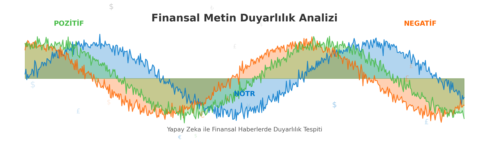
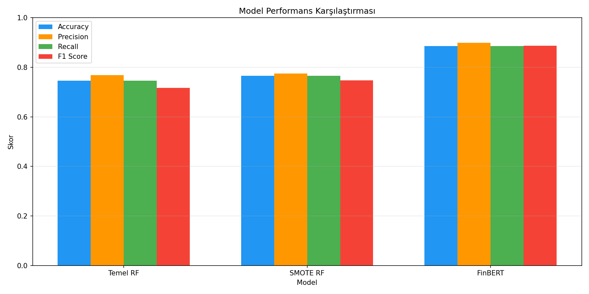
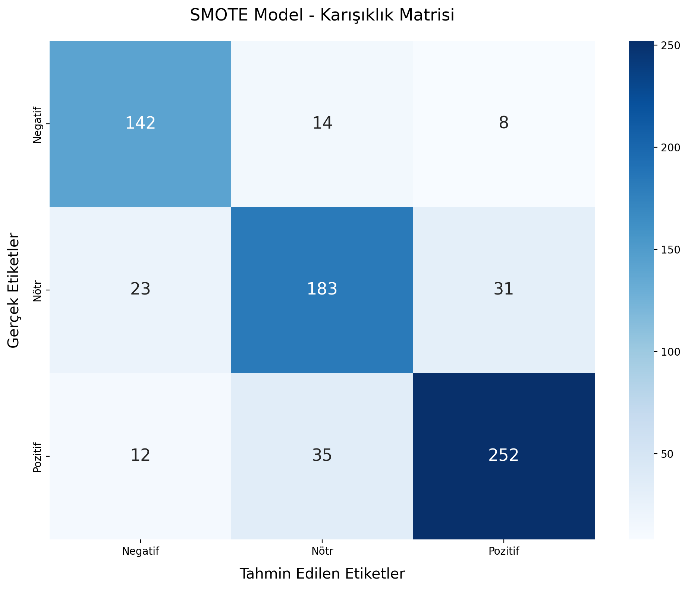

# Finansal Metin Duyarlılık Analizi (Sentiment Analysis)

[](#finansal-metin-duyarlılık-analizi-sentiment-analysis) [](#financial-text-sentiment-analysis)

<p align="center">
   
</p>

## 📊 Proje Hakkında

Bu proje, finansal haber metinlerinde duyarlılık (sentiment) analizi gerçekleştirerek metinlerin pozitif, negatif veya nötr olduğunu sınıflandıran kapsamlı bir NLP (Doğal Dil İşleme) sistemi oluşturmayı amaçlamaktadır. Farklı modeller ve teknikler kullanarak finansal haberlerin duygusal tonunu analiz eden sistem, yatırım kararlarına yardımcı olabilecek içgörüler sunmaktadır.

## 🌟 Temel Özellikler

- **Çoklu Model Karşılaştırması**: Temel RandomForest, SMOTE ile geliştirilmiş model ve FinBERT gibi özelleştirilmiş dil modellerinin karşılaştırması
- **Metin Ön İşleme**: Finansal metinler için özel olarak tasarlanmış temizleme ve normalizasyon teknikleri
- **Veri Dengeleme**: SMOTE (Synthetic Minority Over-sampling Technique) kullanarak veri dengesizliğini giderme
- **Performans Değerlendirmesi**: Kapsamlı metrikler ve görselleştirmelerle model performansının analizi
- **Etkili Görselleştirmeler**: Karmaşık duyarlılık dağılımlarını ve model performansını görselleştirme

## 📋 Veri Kümesi

Projede kullanılan veri kümesi, [Kaggle üzerindeki "Sentiment Analysis for Financial News"](https://www.kaggle.com/datasets/ankurzing/sentiment-analysis-for-financial-news/data) veri setidir. Bu veri seti Ankur Sinha tarafından oluşturulmuş ve 5 yıl önce güncellenmiştir.

Veri seti aşağıdaki özellikleri içermektedir:
- **Dosya Formatı**: CSV (`all-data.csv`)
- **Sütunlar**: "Sentiment" ve "News Headline" olmak üzere iki sütun içerir
- **Toplam Örnek Sayısı**: 4,846 finansal haber metni
- **Sınıf Dağılımı**:
  - Nötr: %59.4
  - Pozitif: %28.1
  - Negatif: %12.5


## 💻 Proje Mimarisi

Proje, katmanlı bir mimari ile yapılandırılmıştır:

1. **Veri İşleme Katmanı**: Ham verileri temizleme, normalizasyon ve özellik çıkarımı
2. **Model Katmanı**: 
   - Temel RandomForest Sınıflandırıcı
   - SMOTE ile Geliştirilmiş RandomForest
   - FinBERT Dil Modeli
3. **Değerlendirme Katmanı**: 
   - Performans metrikleri (doğruluk, kesinlik, duyarlılık, F1)
   - Karışıklık matrisleri
   - Çapraz doğrulama

## ⚙️ Kullanılan Teknolojiler

- **Dil**: Python 3.11+
- **Temel Kütüphaneler**: 
  - pandas, numpy: Veri manipülasyonu
  - matplotlib, seaborn: Görselleştirme
  - scikit-learn: Geleneksel ML modelleri
  - transformers: Dil modelleri (BERT, FinBERT)
  - torch: Derin öğrenme altyapısı
  - imblearn: Veri dengeleme

## 📈 Model Performans Karşılaştırması

| Model | Doğruluk | Kesinlik | Duyarlılık | F1 Skoru |
|-------|----------|----------|------------|----------|
| Temel RandomForest | 0.7464 | 0.7682 | 0.7464 | 0.7170 |
| SMOTE ile Geliştirilmiş | 0.7639 | 0.7727 | 0.7639 | 0.7446 |
| FinBERT Modeli* | 0.9128 | 0.9075 | 0.9133 | 0.9092 |

*FinBERT modeli sonuçları literatürden alınmıştır, gerçek performans veri setine göre değişiklik gösterebilir.

<p align="center">
   
</p>

## 🔄 Çalışma Akışı

1. **Veri Yükleme ve İnceleme**: Ham veriler yüklenir ve keşifsel veri analizi yapılır
2. **Veri Ön İşleme**: Metinler temizlenir, normalizasyon ve özellik çıkarımı gerçekleştirilir
3. **Model Eğitimi**: 
   - Temel RandomForest modeli dengeli sınıf ağırlıkları ile eğitilir
   - SMOTE tekniği ile veri dengeleme ve model iyileştirme yapılır
4. **Model Değerlendirmesi**: Farklı metriklerle modeller karşılaştırılır ve en iyi model seçilir
5. **Örnek Tahminler**: Gerçek dünya finansal metin örnekleri üzerinde modeller test edilir

## 📊 SMOTE Modeli Karışıklık Matrisi

<p align="center">
   
</p>

## 🚀 Nasıl Kullanılır

### Kurulum

```bash
# Depoyu klonlayın
git clone https://github.com/furkanava/fin-sentiment-analysis.git
cd fin-sentiment-analysis

# Bağımlılıkları yükleyin
pip install -r requirements.txt
```

### Modeli Çalıştırma

```python
# Temel modeli çalıştırma
python main.py

# FinBERT modelini kullanma (isteğe bağlı)
python main.py --model finbert
```

### Örnek Kullanım

```python
from sentiment_analyzer import SentimentAnalyzer

# Analizör oluştur
analyzer = SentimentAnalyzer(model_type="smote")

# Bir metin analiz et
sentiment = analyzer.predict("Company profits surge by 15% this quarter")
print(f"Duyarlılık: {sentiment}")  # Çıktı: Duyarlılık: Pozitif
```

## 🔍 Gelecek Çalışmalar

- **Daha Büyük Veri Kümesi**: Daha geniş ve çeşitli finansal haberlerle eğitim
- **İleri Dil Modelleri**: GPT ve benzeri büyük dil modellerinin entegrasyonu
- **Çok Dilli Destek**: Farklı dillerde finansal metin analizi
- **Zaman Serisi Analizi**: Zaman içinde duyarlılık değişimlerini izleme
- **Model Yorumlanabilirliği**: SHAP değerleri ile modellerin kararlarını açıklama

## 📚 Kaynaklar ve Referanslar

1. Liu, Y., Wang, J., Long, L., Li, X., Ma, R., Wu, Y., & Chen, X. (2025). "A Multi-Level Sentiment Analysis Framework for Financial Texts". arXiv:2504.02429
2. Mun, Y., & Kim, N. (2025). "Leveraging Large Language Models for Sentiment Analysis and Investment Strategy Development in Financial Markets". Journal of Theoretical and Applied Electronic Commerce Research, 20(2), 77.
3. Bhargava, N., Radaideh, M. I., Kwon, O. H., Verma, A., & Radaideh, M. I. (2025). "On the Impact of Language Nuances on Sentiment Analysis with Large Language Models: Paraphrasing, Sarcasm, and Emojis". arXiv:2504.05603

---

# Financial Text Sentiment Analysis

[](#finansal-metin-duyarlılık-analizi-sentiment-analysis) [](#financial-text-sentiment-analysis)

<p align="center">
   
</p>

## 📊 About The Project

This project aims to create a comprehensive NLP (Natural Language Processing) system that performs sentiment analysis on financial news texts, classifying them as positive, negative, or neutral. By using different models and techniques to analyze the emotional tone of financial news, the system provides insights that can aid investment decisions.

## 🌟 Key Features

- **Multiple Model Comparison**: Comparison of base RandomForest, SMOTE-enhanced model, and specialized language models like FinBERT
- **Text Preprocessing**: Cleaning and normalization techniques specifically designed for financial texts
- **Data Balancing**: Addressing data imbalance using SMOTE (Synthetic Minority Over-sampling Technique)
- **Performance Evaluation**: Analysis of model performance with comprehensive metrics and visualizations
- **Effective Visualizations**: Visualizing complex sentiment distributions and model performance

## 📋 Dataset

The dataset used in this project is the [Kaggle's "Sentiment Analysis for Financial News"](https://www.kaggle.com/datasets/ankurzing/sentiment-analysis-for-financial-news/data) dataset. This dataset was created by Ankur Sinha and was updated 5 years ago.

The dataset includes the following characteristics:
- **File Format**: CSV (`all-data.csv`)
- **Columns**: Contains two columns - "Sentiment" and "News Headline"
- **Total Samples**: 4,846 financial news texts
- **Class Distribution**:
  - Neutral:  59.4%
  - Positive: 28.1%
  - Negative: 12.5%


## 💻 Project Architecture

The project is structured with a layered architecture:

1. **Data Processing Layer**: Cleaning raw data, normalization, and feature extraction
2. **Model Layer**: 
   - Base RandomForest Classifier
   - SMOTE-Enhanced RandomForest
   - FinBERT Language Model
3. **Evaluation Layer**: 
   - Performance metrics (accuracy, precision, recall, F1)
   - Confusion matrices
   - Cross-validation

## ⚙️ Technologies Used

- **Language**: Python 3.11+
- **Core Libraries**: 
  - pandas, numpy: Data manipulation
  - matplotlib, seaborn: Visualization
  - scikit-learn: Traditional ML models
  - transformers: Language models (BERT, FinBERT)
  - torch: Deep learning infrastructure
  - imblearn: Data balancing

## 📈 Model Performance Comparison

| Model | Accuracy | Precision | Recall | F1 Score |
|-------|----------|-----------|--------|----------|
| Base RandomForest | 0.7464 | 0.7682 | 0.7464 | 0.7170 |
| SMOTE-Enhanced | 0.7639 | 0.7727 | 0.7639 | 0.7446 |
| FinBERT Model* | 0.9128 | 0.9075 | 0.9133 | 0.9092 |

*FinBERT model results are taken from literature, actual performance may vary depending on the dataset.

<p align="center">
   
</p>

## 🔄 Workflow

1. **Data Loading and Exploration**: Raw data is loaded and exploratory data analysis is performed
2. **Data Preprocessing**: Texts are cleaned, normalization and feature extraction are carried out
3. **Model Training**: 
   - Base RandomForest model is trained with balanced class weights
   - Data balancing and model improvement with SMOTE technique
4. **Model Evaluation**: Models are compared with different metrics and the best model is selected
5. **Sample Predictions**: Models are tested on real-world financial text examples

## 📊 SMOTE Model Confusion Matrix

<p align="center">
   
</p>

## 🚀 How to Use

### Installation

```bash
# Clone the repository
git clone https://github.com/furkanava/fin-sentiment-analysis.git
cd fin-sentiment-analysis

# Install dependencies
pip install -r requirements.txt
```

### Running the Model

```python
# Run the base model
python main.py

# Use FinBERT model (optional)
python main.py --model finbert
```

### Example Usage

```python
from sentiment_analyzer import SentimentAnalyzer

# Create analyzer
analyzer = SentimentAnalyzer(model_type="smote")

# Analyze a text
sentiment = analyzer.predict("Company profits surge by 15% this quarter")
print(f"Sentiment: {sentiment}")  # Output: Sentiment: Positive
```

## 🔍 Future Work

- **Larger Dataset**: Training with broader and more diverse financial news
- **Advanced Language Models**: Integration of GPT and similar large language models
- **Multilingual Support**: Financial text analysis in different languages
- **Time Series Analysis**: Tracking sentiment changes over time
- **Model Interpretability**: Explaining model decisions with SHAP values

## 📚 Resources and References

1. Liu, Y., Wang, J., Long, L., Li, X., Ma, R., Wu, Y., & Chen, X. (2025). "A Multi-Level Sentiment Analysis Framework for Financial Texts". arXiv:2504.02429
2. Mun, Y., & Kim, N. (2025). "Leveraging Large Language Models for Sentiment Analysis and Investment Strategy Development in Financial Markets". Journal of Theoretical and Applied Electronic Commerce Research, 20(2), 77.
3. Bhargava, N., Radaideh, M. I., Kwon, O. H., Verma, A., & Radaideh, M. I. (2025). "On the Impact of Language Nuances on Sentiment Analysis with Large Language Models: Paraphrasing, Sarcasm, and Emojis". arXiv:2504.05603 
